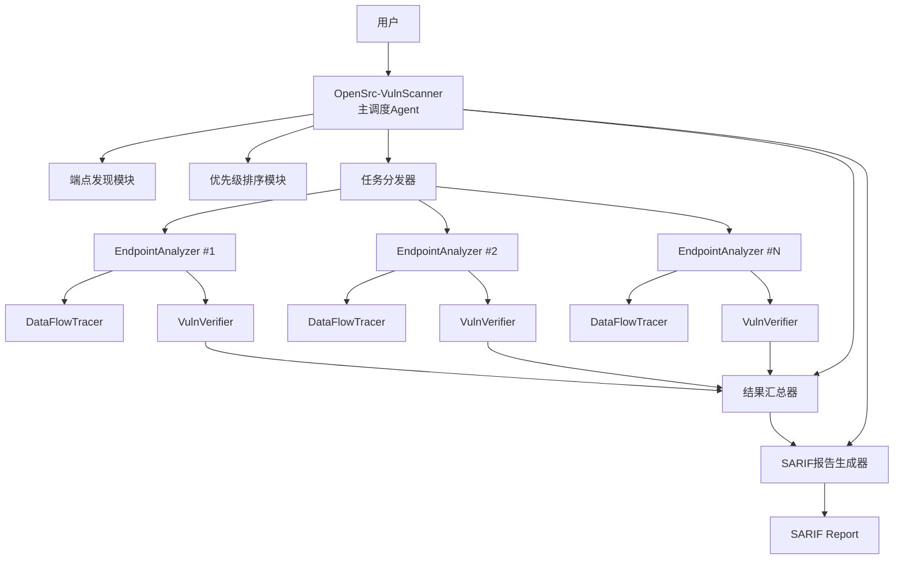
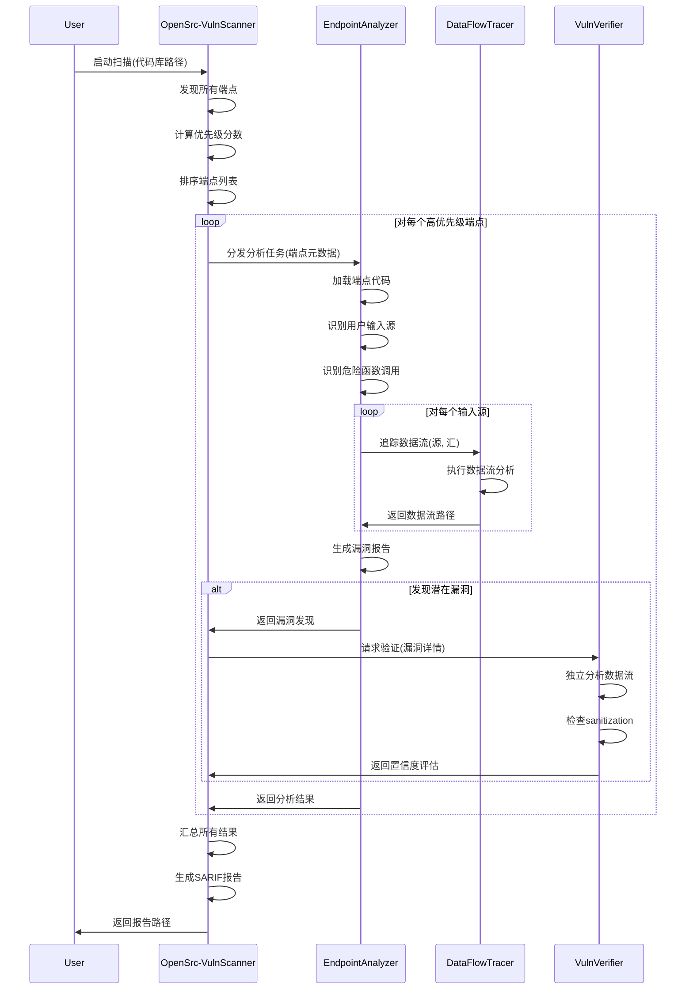

# Design Document

## Overview

本设计文档描述了一个分布式多Agent漏洞扫描系统的架构和实现细节。系统采用主从架构模式，由一个中枢调度Agent（OpenSrc-VulnScanner）协调三个专业化子Agent（EndpointAnalyzer、DataFlowTracer、VulnVerifier）共同完成大规模代码库的安全审查。

系统设计遵循以下核心原则：
- **关注点分离**：每个Agent专注于特定的分析任务
- **并行处理**：支持多个EndpointAnalyzer并行分析不同端点
- **可扩展性**：支持从小型项目到大型企业代码库
- **低误报率**：通过多层验证机制降低误报
- **标准化输出**：生成SARIF 2.1.0格式的标准化报告

## Architecture

### System Architecture



### Agent Communication Flow



### Data Flow Architecture

系统中的数据流分为三个层次：

1. **控制流**：OpenSrc-VulnScanner → EndpointAnalyzer → DataFlowTracer/VulnVerifier
2. **数据流**：端点元数据 → 分析结果 → 验证结果 → 汇总报告
3. **文件流**：源代码文件 → AST解析 → 符号表 → 数据流图

## Components and Interfaces

### 1. OpenSrc-VulnScanner (主调度Agent)

**职责：**
- 扫描代码库发现所有远程访问端点
- 计算端点优先级分数并排序
- 分发分析任务给EndpointAnalyzer
- 协调VulnVerifier进行二次验证
- 汇总所有分析结果
- 生成SARIF格式报告

**接口：**

```typescript
interface OpenSrcVulnScanner {
  // 主入口函数
  scanCodebase(options: ScanOptions): Promise<ScanResult>;
  
  // 端点发现
  discoverEndpoints(codebasePath: string): Promise<Endpoint[]>;
  
  // 优先级计算
  calculatePriority(endpoint: Endpoint): number;
  
  // 任务分发
  dispatchAnalysis(endpoints: Endpoint[], concurrency: number): Promise<AnalysisResult[]>;
  
  // 结果汇总
  aggregateResults(results: AnalysisResult[]): AggregatedFindings;
  
  // 报告生成
  generateSARIF(findings: AggregatedFindings): SARIFReport;
}

interface ScanOptions {
  codebasePath: string;
  outputDir: string;
  concurrency?: number;  // 默认: 5
  topN?: number;         // 分析前N个端点，默认: 所有
  includeLowConfidence?: boolean;  // 默认: false
  languages?: string[];  // 默认: 自动检测
}

interface Endpoint {
  filePath: string;
  lineNumber: number;
  httpMethod?: string;  // GET, POST, etc.
  routePattern: string;
  handlerFunction: string;
  framework: string;    // Express, Flask, Spring, etc.
  language: string;     // JavaScript, Python, Java, etc.
  requiresAuth: boolean;
  priorityScore: number;
}
```

### 2. EndpointAnalyzer (端点分析Agent)

**职责：**
- 深度分析单个端点的安全漏洞
- 识别所有用户输入源
- 调用DataFlowTracer追踪数据流
- 识别危险函数调用（命令执行、文件操作等）
- 生成详细的漏洞报告

**接口：**

```typescript
interface EndpointAnalyzer {
  // 分析端点
  analyzeEndpoint(task: AnalysisTask): Promise<AnalysisResult>;
  
  // 识别用户输入源
  identifyInputSources(endpoint: Endpoint): InputSource[];
  
  // 识别危险函数
  identifyDangerousSinks(code: string): DangerousSink[];
  
  // 检测认证机制
  detectAuthMechanism(endpoint: Endpoint): AuthInfo;
}

interface AnalysisTask {
  endpoint: Endpoint;
  focusAreas?: VulnerabilityType[];  // 可选：指定关注的漏洞类型
}

interface InputSource {
  type: 'query' | 'body' | 'header' | 'cookie' | 'path';
  name: string;
  location: CodeLocation;
}

interface DangerousSink {
  type: VulnerabilityType;
  functionName: string;
  location: CodeLocation;
  cweId: number;
}

interface AnalysisResult {
  endpoint: Endpoint;
  findings: Finding[];
  authInfo: AuthInfo;
  analysisTime: number;
  errors?: string[];
}

interface Finding {
  vulnerabilityType: VulnerabilityType;
  severity: Severity;
  cweId: number;
  location: CodeLocation;
  dataFlowPath: DataFlowPath;
  codeSnippet: string;
  confidence: 'INITIAL';  // 初始置信度，等待验证
}
```

### 3. DataFlowTracer (数据流追踪Agent)

**职责：**
- 执行精确的数据流分析
- 追踪变量从源到汇的完整路径
- 识别路径中的sanitization和validation
- 评估数据流路径的可利用性

**接口：**

```typescript
interface DataFlowTracer {
  // 追踪数据流
  traceDataFlow(request: TraceRequest): Promise<DataFlowPath>;
  
  // 检测sanitization
  detectSanitization(path: DataFlowPath): SanitizationInfo[];
  
  // 检测validation
  detectValidation(path: DataFlowPath): ValidationInfo[];
  
  // 评估可利用性
  assessExploitability(path: DataFlowPath): ExploitabilityScore;
}

interface TraceRequest {
  sourceLocation: CodeLocation;
  sinkLocation: CodeLocation;
  sourceVariable: string;
  sinkFunction: string;
  maxDepth?: number;  // 默认: 10
}

interface DataFlowPath {
  source: CodeLocation;
  sink: CodeLocation;
  steps: DataFlowStep[];
  hasSanitization: boolean;
  hasValidation: boolean;
  classification: 'CONFIRMED' | 'LIKELY' | 'POSSIBLE';
}

interface DataFlowStep {
  type: 'assignment' | 'function_call' | 'return' | 'parameter';
  location: CodeLocation;
  code: string;
  variable: string;
}

interface SanitizationInfo {
  functionName: string;
  location: CodeLocation;
  effectiveness: 'STRONG' | 'WEAK' | 'UNKNOWN';
}

interface ValidationInfo {
  type: 'type_check' | 'range_check' | 'regex' | 'whitelist' | 'blacklist';
  location: CodeLocation;
  effectiveness: 'STRONG' | 'WEAK' | 'UNKNOWN';
}
```

### 4. VulnVerifier (验证Agent)

**职责：**
- 独立验证发现的漏洞
- 使用不同的分析方法和启发式规则
- 评估sanitization和validation的有效性
- 返回置信度评估

**接口：**

```typescript
interface VulnVerifier {
  // 验证漏洞
  verifyVulnerability(finding: Finding): Promise<VerificationResult>;
  
  // 重新分析数据流
  reanalyzeDataFlow(path: DataFlowPath): Promise<DataFlowPath>;
  
  // 评估sanitization有效性
  assessSanitization(sanitization: SanitizationInfo, vulnType: VulnerabilityType): boolean;
  
  // 评估validation有效性
  assessValidation(validation: ValidationInfo, vulnType: VulnerabilityType): boolean;
}

interface VerificationResult {
  originalFinding: Finding;
  confidence: 'CONFIRMED' | 'UNCERTAIN' | 'REJECTED';
  reasoning: string;
  additionalEvidence?: string[];
  updatedSeverity?: Severity;
}
```

### Common Data Models

```typescript
type VulnerabilityType = 
  | 'RCE' 
  | 'COMMAND_INJECTION' 
  | 'AUTH_BYPASS' 
  | 'ARBITRARY_FILE_READ' 
  | 'PATH_TRAVERSAL';

type Severity = 'CRITICAL' | 'HIGH' | 'MEDIUM' | 'LOW';

type Confidence = 'HIGH_CONFIDENCE' | 'MEDIUM_CONFIDENCE' | 'LOW_CONFIDENCE';

interface CodeLocation {
  filePath: string;
  lineNumber: number;
  columnNumber?: number;
  functionName?: string;
}

interface AuthInfo {
  requiresAuth: boolean;
  authType?: 'JWT' | 'SESSION' | 'API_KEY' | 'OAUTH' | 'BASIC' | 'NONE';
  authMiddleware?: string[];
  rbacChecks?: string[];
}

interface ScanResult {
  sarifReportPath: string;
  summary: {
    totalEndpoints: number;
    analyzedEndpoints: number;
    totalFindings: number;
    bySeverity: Record<Severity, number>;
    byType: Record<VulnerabilityType, number>;
    byConfidence: Record<Confidence, number>;
  };
  executionTime: number;
  errors: string[];
}
```

## Data Models

### Endpoint Discovery Data Model

端点发现阶段需要识别不同语言和框架的端点模式：

**Python (Flask/Django/FastAPI):**
```python
# Flask
@app.route('/api/users/<user_id>', methods=['GET', 'POST'])
def get_user(user_id):
    pass

# Django
path('api/users/<int:user_id>/', views.get_user)

# FastAPI
@app.get("/api/users/{user_id}")
async def get_user(user_id: int):
    pass
```

**Node.js (Express/Koa/Fastify):**
```javascript
// Express
app.get('/api/users/:userId', (req, res) => {});

// Koa
router.get('/api/users/:userId', async (ctx) => {});

// Fastify
fastify.get('/api/users/:userId', async (request, reply) => {});
```

**Java (Spring Boot):**
```java
@GetMapping("/api/users/{userId}")
public User getUser(@PathVariable Long userId) {}

@PostMapping("/api/users")
public User createUser(@RequestBody User user) {}
```

**Go (net/http, Gin, Echo):**
```go
// net/http
http.HandleFunc("/api/users/", getUserHandler)

// Gin
r.GET("/api/users/:userId", getUserHandler)

// Echo
e.GET("/api/users/:userId", getUserHandler)
```

**Rust (Actix-web, Rocket, Axum):**
```rust
// Actix-web
#[get("/api/users/{user_id}")]
async fn get_user(user_id: web::Path<i32>) -> impl Responder {}

// Rocket
#[get("/api/users/<user_id>")]
fn get_user(user_id: i32) -> Json<User> {}

// Axum
async fn get_user(Path(user_id): Path<i32>) -> Json<User> {}
```

**C/C++ (网络库):**
```c
// 识别socket API调用
socket(), bind(), listen(), accept()
// HTTP库
evhtp_set_cb(), mg_set_request_handler()
```

### Vulnerability Pattern Data Model

每种漏洞类型都有特定的源-汇模式：

**RCE (Remote Code Execution):**
- Sources: 用户输入（request参数、body、headers）
- Sinks: `eval()`, `exec()`, `Function()`, `vm.runInContext()`, `__import__()`, `Runtime.exec()`, `system()`, `popen()`

**Command Injection:**
- Sources: 用户输入
- Sinks: `os.system()`, `subprocess.call()`, `child_process.exec()`, `Runtime.exec()`, `system()`, `popen()`, `shell_exec()`

**Authentication Bypass:**
- Patterns: 
  - 缺少认证中间件
  - 硬编码凭据
  - 弱密码验证（如 `password == "admin"`）
  - JWT验证缺失或错误
  - Session验证绕过

**Arbitrary File Read:**
- Sources: 用户输入（文件路径参数）
- Sinks: `open()`, `readFile()`, `FileInputStream()`, `File::open()`, `fopen()`

**Path Traversal:**
- Sources: 用户输入（文件路径参数）
- Patterns: 缺少路径规范化、包含 `../`、缺少路径前缀验证

### Priority Scoring Model

优先级分数计算公式：

```
priority_score = base_score + name_bonus + accessibility_bonus + size_penalty

base_score = 50

name_bonus:
  - "admin", "管理" → +30
  - "auth", "login", "认证", "登录" → +25
  - "upload", "file", "上传", "文件" → +20
  - "exec", "cmd", "command", "执行" → +25
  - "eval", "run" → +20
  - "download", "read", "下载", "读取" → +15

accessibility_bonus:
  - 无认证要求 → +20
  - 有认证但弱验证 → +10
  - 强认证 → +0

size_penalty:
  - handler函数 > 500行 → -10 (复杂度高，可能有更多保护)
  - handler函数 < 50行 → +5 (简单函数，可能缺少保护)
```

## Correctness Properties

*A property is a characteristic or behavior that should hold true across all valid executions of a system-essentially, a formal statement about what the system should do. Properties serve as the bridge between human-readable specifications and machine-verifiable correctness guarantees.*

基于需求文档中的验收标准,我们定义以下可测试的正确性属性:

### Property 1: Endpoint Discovery Completeness
*For any* codebase containing endpoint definitions, the discovered endpoint list should include all endpoints that match the supported framework patterns.
**Validates: Requirements 1.1-1.9**

### Property 2: Priority Score Consistency
*For any* two endpoints, if endpoint A contains high-risk keywords ("admin", "exec", "upload") and endpoint B does not, then A's priority score should be higher than B's priority score.
**Validates: Requirements 9.1, 9.2**

### Property 3: Priority Score Ordering
*For any* list of discovered endpoints, after sorting by priority score, each endpoint's score should be greater than or equal to the next endpoint's score.
**Validates: Requirements 9.4**

### Property 4: Severity Assignment for RCE
*For any* vulnerability identified as RCE type, the assigned severity level should be CRITICAL.
**Validates: Requirements 4.1**

### Property 5: Severity Assignment for Command Injection
*For any* vulnerability identified as COMMAND_INJECTION type, the assigned severity level should be CRITICAL.
**Validates: Requirements 4.2**

### Property 6: Severity Assignment for Auth Bypass
*For any* vulnerability identified as AUTH_BYPASS type, the assigned severity level should be MEDIUM (or lower if adjusted by authentication requirements).
**Validates: Requirements 4.3**

### Property 7: Severity Assignment for File Read
*For any* vulnerability identified as ARBITRARY_FILE_READ type, the assigned severity level should be HIGH (or lower if adjusted by authentication requirements).
**Validates: Requirements 4.4**

### Property 8: Severity Assignment for Path Traversal
*For any* vulnerability identified as PATH_TRAVERSAL type, the assigned severity level should be HIGH (or lower if adjusted by authentication requirements).
**Validates: Requirements 4.5**

### Property 9: Authentication Severity Adjustment
*For any* vulnerability found in an authenticated endpoint, the final severity should be one level lower than the base severity for that vulnerability type.
**Validates: Requirements 4.6**

### Property 10: Data Flow Path Completeness
*For any* data flow trace from source to sink, the returned path should include all intermediate steps (assignments, function calls, returns).
**Validates: Requirements 11.2, 11.6**

### Property 11: Sanitization Detection
*For any* data flow path that passes through a known sanitization function, the path should be marked with hasSanitization=true.
**Validates: Requirements 11.4**

### Property 12: Validation Detection
*For any* data flow path that includes validation checks, the path should be marked with hasValidation=true.
**Validates: Requirements 11.5**

### Property 13: Confidence Level Mapping
*For any* finding verified by VulnVerifier, if the verifier returns CONFIRMED, the finding's confidence should be HIGH_CONFIDENCE; if UNCERTAIN, then MEDIUM_CONFIDENCE; if REJECTED, then LOW_CONFIDENCE.
**Validates: Requirements 5.3, 5.4, 5.5**

### Property 14: Report Filtering by Confidence
*For any* final SARIF report generated with default settings, all included findings should have confidence level of HIGH_CONFIDENCE or MEDIUM_CONFIDENCE.
**Validates: Requirements 5.6**

### Property 15: SARIF Report Structure
*For any* generated SARIF report, it should conform to SARIF 2.1.0 schema and include all required fields: tool information, results array, and invocations.
**Validates: Requirements 6.1**

### Property 16: SARIF Finding Completeness
*For any* finding included in the SARIF report, it should contain: vulnerability type, severity, CWE identifier, file location, line number, code snippet, and data flow path.
**Validates: Requirements 6.3, 6.4**

### Property 17: Endpoint Metadata in Report
*For any* finding in the SARIF report, the associated endpoint metadata should include: HTTP method, route pattern, authentication requirements, and handler function name.
**Validates: Requirements 6.5**

### Property 18: Summary Statistics Accuracy
*For any* SARIF report, the summary statistics should accurately reflect the count of findings by severity and by type.
**Validates: Requirements 6.6**

### Property 19: Parallel Processing Limit
*For any* analysis run with concurrency limit N, the number of simultaneously active EndpointAnalyzer agents should never exceed N.
**Validates: Requirements 9.7**

### Property 20: Error Recovery Continuation
*For any* endpoint that encounters an analysis error, the system should log the error and continue processing remaining endpoints without terminating.
**Validates: Requirements 7.3**

### Property 21: Progress Output Format
*For any* endpoint being analyzed, the progress output should match the format "[current/total] Analyzing endpoint: [route]".
**Validates: Requirements 8.2**

### Property 22: Data Flow Depth Limit
*For any* data flow analysis, the recursion depth should not exceed the configured maximum depth (default: 10).
**Validates: Requirements 7.5**

## Error Handling

系统采用分层错误处理策略,确保单个组件的失败不会导致整个系统崩溃:

### OpenSrc-VulnScanner Error Handling

1. **端点发现错误**
   - 文件读取失败: 记录错误,跳过该文件,继续处理其他文件
   - AST解析失败: 记录错误,标记该文件为不可分析,继续处理
   - 未知框架: 记录警告,尝试通用模式匹配

2. **任务分发错误**
   - EndpointAnalyzer启动失败: 重试最多3次,失败后跳过该端点
   - 超时: 设置30分钟超时,超时后终止该分析任务,继续下一个
   - 通信错误: 记录错误,标记该端点为分析失败

3. **报告生成错误**
   - 输出目录不可写: 尝试备用路径(临时目录)
   - SARIF序列化失败: 记录详细错误信息,生成简化版报告
   - 磁盘空间不足: 清理临时文件,压缩报告

### EndpointAnalyzer Error Handling

1. **代码加载错误**
   - 文件不存在: 返回错误报告给OpenSrc-VulnScanner
   - 编码问题: 尝试多种编码(UTF-8, GBK, Latin-1)
   - 语法错误: 记录错误,尝试部分分析

2. **分析错误**
   - AST构建失败: 降级到正则表达式模式匹配
   - 符号解析失败: 记录警告,继续分析其他部分
   - 内存不足: 限制分析范围,只分析handler函数本身

3. **DataFlowTracer调用错误**
   - 超时: 设置5分钟超时,超时后标记为POSSIBLE
   - 无法追踪: 标记为UNCERTAIN,继续其他输入源

### DataFlowTracer Error Handling

1. **追踪错误**
   - 递归深度超限: 返回部分路径,标记为POSSIBLE
   - 未知函数调用: 假设数据流继续,标记为LIKELY
   - 动态代码: 无法静态分析,标记为UNCERTAIN

2. **Sanitization检测错误**
   - 未知sanitization函数: 保守处理,标记为UNKNOWN effectiveness
   - 自定义sanitization: 尝试启发式分析

### VulnVerifier Error Handling

1. **验证错误**
   - 重新分析失败: 返回UNCERTAIN
   - 超时: 返回UNCERTAIN
   - 无法访问代码: 返回UNCERTAIN

2. **评估错误**
   - 无法判断sanitization有效性: 标记为WEAK
   - 无法判断validation有效性: 标记为WEAK

### Error Logging

所有错误都应记录以下信息:
- 时间戳
- 错误类型
- 错误消息
- 堆栈跟踪(如果适用)
- 相关上下文(文件路径、端点信息等)
- 恢复操作

错误日志格式:
```json
{
  "timestamp": "2026-01-22T10:30:45Z",
  "level": "ERROR",
  "agent": "EndpointAnalyzer",
  "errorType": "ASTParseError",
  "message": "Failed to parse Python file",
  "context": {
    "filePath": "/path/to/file.py",
    "endpoint": "/api/users",
    "lineNumber": 42
  },
  "stackTrace": "...",
  "recovery": "Falling back to regex pattern matching"
}
```

## Testing Strategy

系统采用双重测试策略:单元测试验证具体功能,属性测试验证通用正确性。

### Unit Testing

单元测试覆盖以下关键功能:

**OpenSrc-VulnScanner:**
- 端点发现: 测试各种框架的端点识别
- 优先级计算: 测试特定关键词的分数计算
- SARIF生成: 测试报告格式正确性

**EndpointAnalyzer:**
- 输入源识别: 测试各种输入类型的识别
- 危险函数识别: 测试已知危险函数的检测
- 认证机制检测: 测试各种认证模式的识别

**DataFlowTracer:**
- 简单数据流: 测试直接赋值的追踪
- 函数调用追踪: 测试跨函数的数据流
- Sanitization检测: 测试已知sanitization函数的识别

**VulnVerifier:**
- 验证逻辑: 测试不同场景的验证结果
- Sanitization评估: 测试有效性判断
- Validation评估: 测试有效性判断

### Property-Based Testing

使用 **fast-check** (JavaScript/TypeScript) 作为属性测试库。每个属性测试运行至少100次迭代。

**测试框架配置:**
```typescript
import fc from 'fast-check';

// 配置
const config = {
  numRuns: 100,  // 最少100次迭代
  timeout: 5000,  // 5秒超时
  verbose: true
};
```

**属性测试实现要求:**
1. 每个正确性属性必须有对应的属性测试
2. 每个测试必须用注释标注对应的属性编号
3. 测试必须使用智能生成器,约束输入空间
4. 测试必须验证真实功能,不使用mock

**示例属性测试:**

```typescript
// Feature: vulnerability-scanner, Property 2: Priority Score Consistency
test('endpoints with high-risk keywords have higher priority', () => {
  fc.assert(
    fc.property(
      fc.record({
        routeA: fc.string().filter(s => /admin|exec|upload/.test(s)),
        routeB: fc.string().filter(s => !/admin|exec|upload/.test(s)),
        // ... other endpoint fields
      }),
      (data) => {
        const endpointA = createEndpoint(data.routeA, ...);
        const endpointB = createEndpoint(data.routeB, ...);
        
        const scoreA = calculatePriority(endpointA);
        const scoreB = calculatePriority(endpointB);
        
        expect(scoreA).toBeGreaterThan(scoreB);
      }
    ),
    config
  );
});

// Feature: vulnerability-scanner, Property 10: Data Flow Path Completeness
test('data flow paths include all intermediate steps', () => {
  fc.assert(
    fc.property(
      generateRandomCodeWithDataFlow(),
      async (code) => {
        const path = await traceDataFlow(code.source, code.sink);
        
        // 验证路径完整性
        expect(path.steps.length).toBeGreaterThan(0);
        expect(path.steps[0].location).toEqual(code.source);
        expect(path.steps[path.steps.length - 1].location).toEqual(code.sink);
        
        // 验证步骤连续性
        for (let i = 0; i < path.steps.length - 1; i++) {
          const current = path.steps[i];
          const next = path.steps[i + 1];
          expect(isConnected(current, next)).toBe(true);
        }
      }
    ),
    config
  );
});
```

### Integration Testing

集成测试验证Agent之间的协作:

1. **端到端测试**: 使用真实的小型代码库测试完整流程
2. **Agent通信测试**: 验证Agent之间的消息传递
3. **并发测试**: 验证多个EndpointAnalyzer并行工作
4. **错误恢复测试**: 模拟各种错误场景,验证恢复机制

### Test Data

测试数据包括:
- **真实代码样本**: 从开源项目中提取的真实端点代码
- **合成漏洞**: 人工构造的包含已知漏洞的代码
- **边界情况**: 极端情况(空文件、超大文件、深度嵌套等)
- **多语言样本**: 覆盖所有支持的编程语言和框架

### Test Coverage Goals

- 单元测试代码覆盖率: > 80%
- 属性测试覆盖所有22个正确性属性
- 集成测试覆盖所有Agent交互场景
- 端到端测试覆盖所有支持的语言和框架

